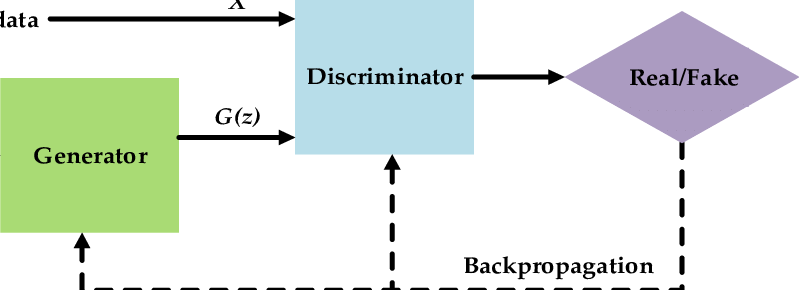
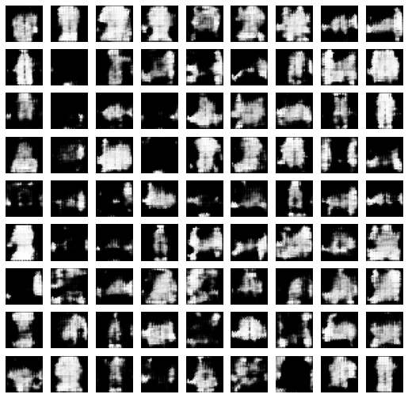
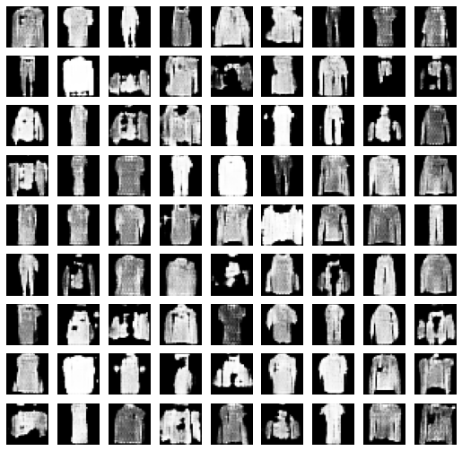

# Generative Adversarial Network (GAN)

In this notebook I explore Generative Adversarial Networks (GAN). As for a training data MNIST's fashion dataset is used to train the model in unsupervided manner in order to generate the fake images which look like the real ones. The architecture of GNA model consists of two major blocks - generator and discriminator, which compete in an ersatz game where one's gain is another's loss. The generator generates a random data which is fed to discriminator whose job is to differentiate the fake data from an original data. The result is then backpropagated to generator which tries to minimiwe the error in order to fool the discriminator into believing that it is a real data. 

While the model is being trained for each second epoch the results are plotted to track the progress. On the image given below there's a clear improvement of the generated data, we can clearly see that the images on the second plot are very similar to original images from Mnist fashion dataset. On the first image the results from earlier epoch are given, while on the second one the results from final train are demonstrated.

 

